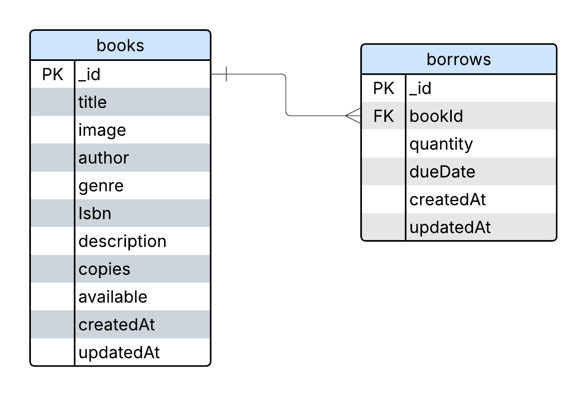

<h1 align="center">📚 Library Management Server</h1>

<p align="center">The Library Management API is a backend system built with Express, TypeScript, and MongoDB (Mongoose). It manages books with schema validation, supports CRUD operations, enforces valid genres and unique ISBNs, and handles borrowing through Mongoose methods. Aggregation is used to summarize borrow data, providing an efficient, schema-driven solution for library systems.</p>



---

**`API`:** [Link](https://library-management-server-one-eta.vercel.app)  
**`Explanation`:** [Video](https://www.loom.com/share/90b206e371ad4f0599a4b0a3b59ca538?sid=ceef0fad-f71e-4f9b-b5ff-a506bdbbee8c)

## 🚀 Features

- Automatic copy deduction & availability status update
- Borrowed book summary via aggregation
- Filtering, sorting for books

## 📦 Technologies Used

- **Node.js + Express**
- **TypeScript**
- **MongoDB + Mongoose**
- **Zod** (for schema validation)
- **dotenv**
- **ESLint + Prettier** (for code quality)

## 🛠️ Project Setup

```bash
# 1. Clone the repository
git clone https://github.com/Mdafsarx/Library-management-server
cd Library-management-server

# 2. Install dependencies
npm install

# 3. Set up environment variables
touch .env
```

### `.env` Example:
```
PORT = 4000
DB_NAME = ******
DB_PASSWORD = *****
```
## 📂 Folder Structure

```sh
LIBRARY-MANAGEMENT-SERVER/
├── .vercel/                     # Vercel deployment configuration
├── dist/                        # Compiled TypeScript files
├── node_modules/                # Node.js dependencies
├── src/                         # Source code
│   ├── config/                  # Environment and DB config
│   ├── controllers/             # Request handlers
│   ├── middlewares/             # Custom Express middlewares (e.g., error handling)
│   ├── models/                  # Mongoose schemas and methods
│   ├── routes/                  # API route definitions
│   ├── services/                # Business logic layer
│   ├── tests/                   # Unit and integration tests
│   ├── types/                   # TypeScript custom types and interfaces
│   ├── validations/             # Zod schemas for request validation
│   ├── app.ts                   # Express app setup
│   └── server.ts                # Server entry point
├── .env                         # Environment variables
├── .gitignore                   # Git ignore rules
├── .prettierignore              # Prettier ignore rules
├── .prettierrc.json             # Prettier config
├── erdiagram.png                # ER diagram image
├── eslint.config.mjs            # ESLint configuration
├── package-lock.json            # NPM lockfile
├── package.json                 # Project metadata and scripts
├── README.md                    # Project documentation
├── tsconfig.json                # TypeScript compiler config
└── vercel.json                  # Vercel project settings
```

## 📘 API Endpoints

**Base URL**

```bash
http://localhost:5000/api
```

### 1. Create a Book

**POST** `/api/books`

```json
{
  "title": "The Theory of Everything",
  "author": "Stephen Hawking",
  "genre": "SCIENCE",
  "isbn": "9780553380163",
  "description": "An overview of cosmology and black holes.",
  "copies": 5,
  "available": true
}
```

### 2. Get All Books

**GET** `/api/books?filter=SCIENCE&sortBy=createdAt&sort=desc&limit=5`

Supports:
- `filter` (genre)
- `sortBy` (e.g., createdAt)
- `sort` (asc|desc)
- `limit` (number of items)

### 3. Get Book by ID

**GET** `/api/books/:bookId`

### 4. Update Book

**PUT** `/api/books/:bookId`

```json
{
  "copies": 50
}
```

### 5. Delete Book

**DELETE** `/api/books/:bookId`

### 6. Borrow a Book

**POST** `/api/borrow`

```json
{
  "book": "64ab3f9e2a4b5c6d7e8f9012",
  "quantity": 2,
  "dueDate": "2025-07-18T00:00:00.000Z"
}
```

📌 Business Logic:
- Quantity must be less than or equal to available copies
- Deduct copies automatically
- If copies become 0, set `available = false`

### 7. Borrowed Books Summary

**GET** `/api/borrow`

📌 Uses MongoDB Aggregation to return:

```json
[
  {
    "book": {
      "title": "The Theory of Everything",
      "isbn": "9780553380163"
    },
    "totalQuantity": 5
  }
]
```

## 🔍 Validations

### Book Schema

| Field         | Type      | Required | Validation                                                                     |
| ------------- | --------- | -------- | ------------------------------------------------------------------------------ |
| `title`       | `string`  | `Yes`    | —                                                                              |
| `author`      | `string`  | `Yes`    | —                                                                              |
| `genre`       | `enum`    | `Yes`    | One of: `FICTION`, `NON_FICTION`, `SCIENCE`, `HISTORY`, `BIOGRAPHY`, `FANTASY` |
| `isbn`        | `string`  | `Yes`    | Must be a valid string (unique enforced in DB)                                 |
| `description` | `string`  | `No`     | Optional field                                                                 |
| `copies`      | `number`  | `Yes`    | Must be an integer ≥ 0                                                         |
| `available`   | `boolean` | `No`     | Optional field, defaults to `true` if not provided                             |

### Borrow Schema

| Field      | Type       | Required | Validation           |
| ---------- | ---------- | -------- | -------------------- |
| `book`     | `ObjectId` | `Yes`    | Must be a valid book |
| `quantity` | `number`   | `Yes`    | Must be positive     |
| `dueDate`  | `Date`     | `Yes`    | Future date required |

## Author

**Md Afsar Mahmud**  
Full Stack Developer  
[HackerRank](https://www.hackerrank.com/profile/mdafsar) •
[LinkedIn](https://www.linkedin.com/in/md-afsar-mahmud)